# ClipStudio

**A desktop app for managing, tagging, and curating your gameplay replay library.**

Built for players who record everything but never have time to find the good moments — ClipStudio turns a folder of raw OBS replays into a searchable, tagged, exportable highlight reel.

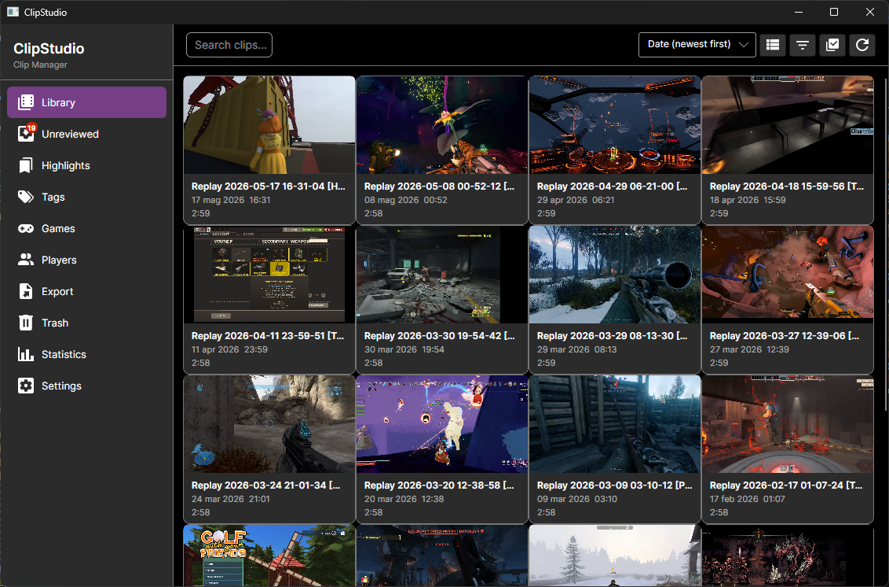

---

## Features

- **Automatic import** — watches your OBS replay folder and imports new clips as they land, no manual steps
- **Game detection** — reads the `[Game Name]` tag embedded by the OBS script (or set it manually from a Steam-backed picker)
- **Highlight editor** — mark in/out points on the timeline to create named, tagged, rated highlights; overlapping highlights are fully supported
- **Tag system** — hierarchical general tags + game tags; clips inherit tags from their highlights for search
- **Players** — track who was in each session; mark yourself with *IsMe* and get auto-tagged on every import
- **Audio track mixing** — multi-track clips get per-track volume and mute controls; FFmpeg preview mix in real time
- **Subtitle / caption support** — local Whisper transcription generates searchable captions synced to the timeline
- **Trim & Export** — non-destructive (stream copy) or destructive (re-encode) export, queued and processed in the background
- **Stats dashboard** — play counts, rating distribution, top games and tags
- **Bulk edit** — select multiple clips and apply tags, game, or players in one action; copy metadata from one clip to others with the format-brush
- **Duplicate detection** — recognises a recording you already have, even under a different name, on import *and* across the whole library
- **Clip links** — connect clips as the same moment, a sequel, a reaction or a variant; each is findable from the other
- **Game import** — reads the games your launchers have installed and creates game tags from them, cover art included
- **Attention required** — one list of everything the library needs you to decide about: missing files, disconnected drives, un-imported files, duplicates and out-of-range highlights
- **Automatic updates** — tells you when a new version exists and never downloads it without asking
- **Cross-platform** — Windows, macOS, Linux (Avalonia UI)

---

## Screenshots

| Library | Unreviewed Queue |
|---|---|
|  | 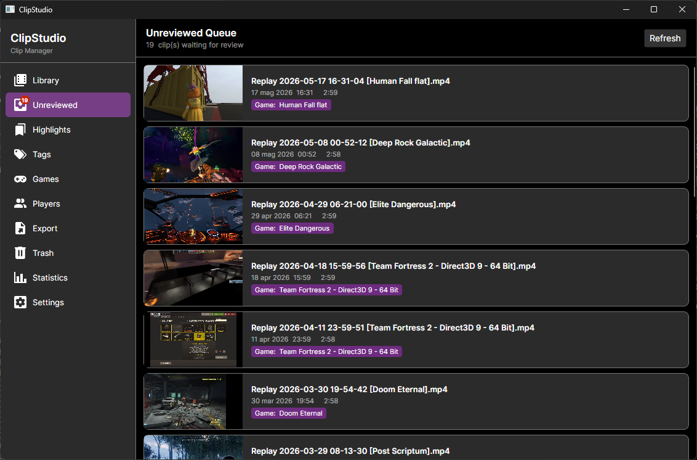 |

| Games | Stats |
|---|---|
| 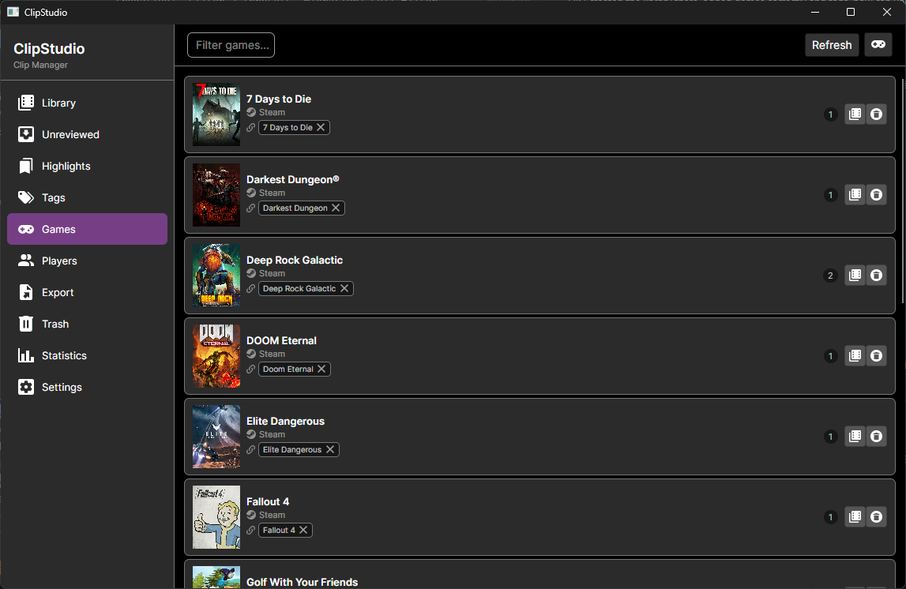 | 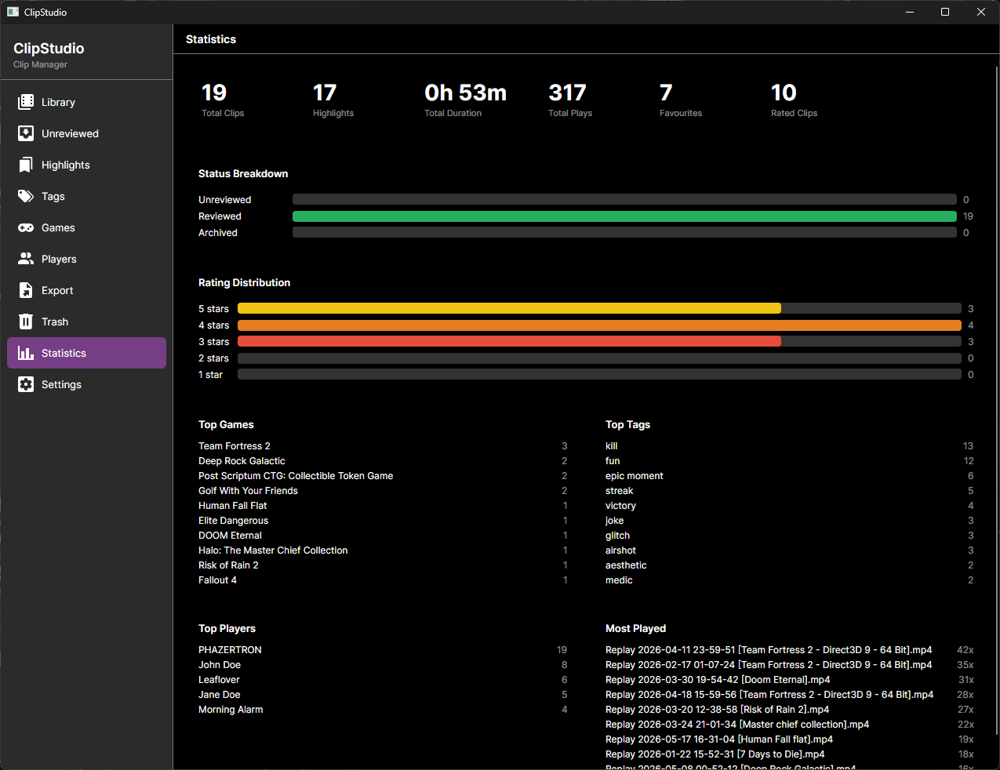 |

| Tags | Players |
|---|---|
| 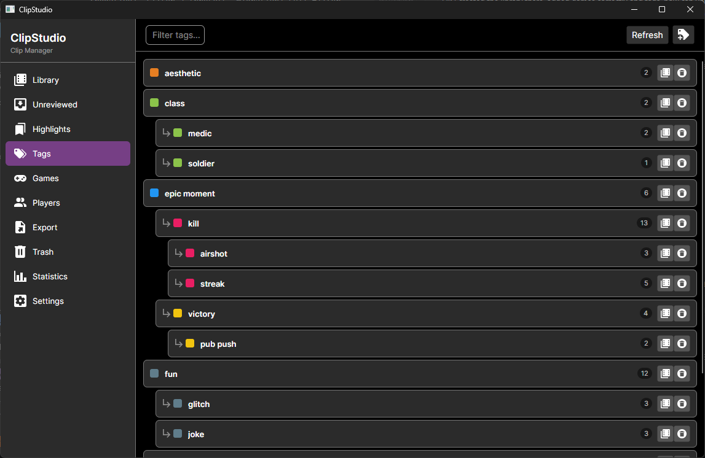 | 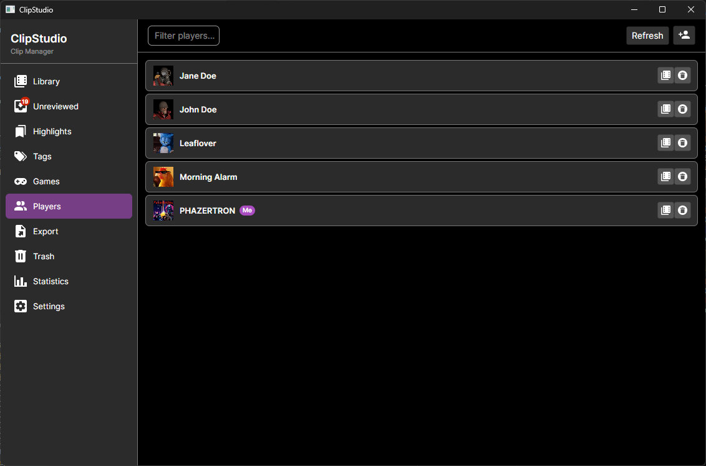 |

| Highlights Page | Clip Editor — Metadata |
|---|---|
| 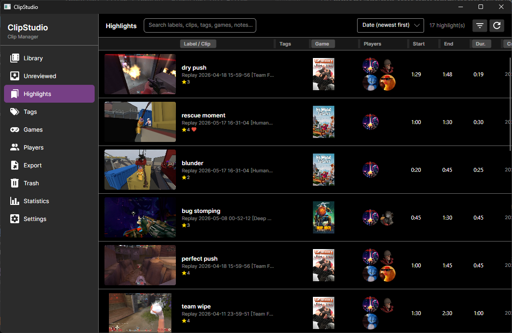 | 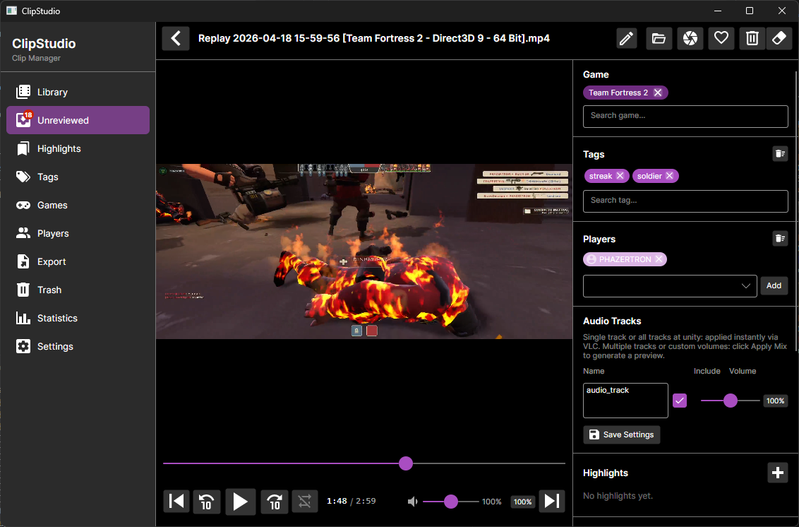 |

| Clip Editor — Highlights & Captions | Clip Editor — Trim & Export |
|---|---|
| 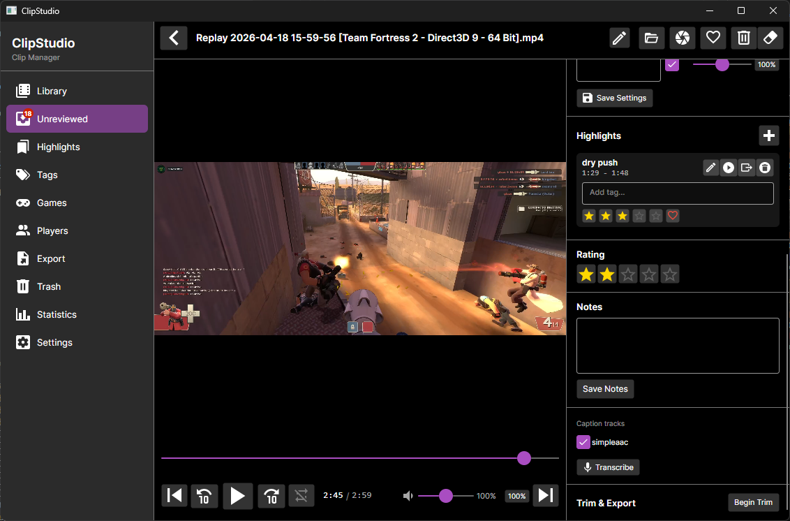 | 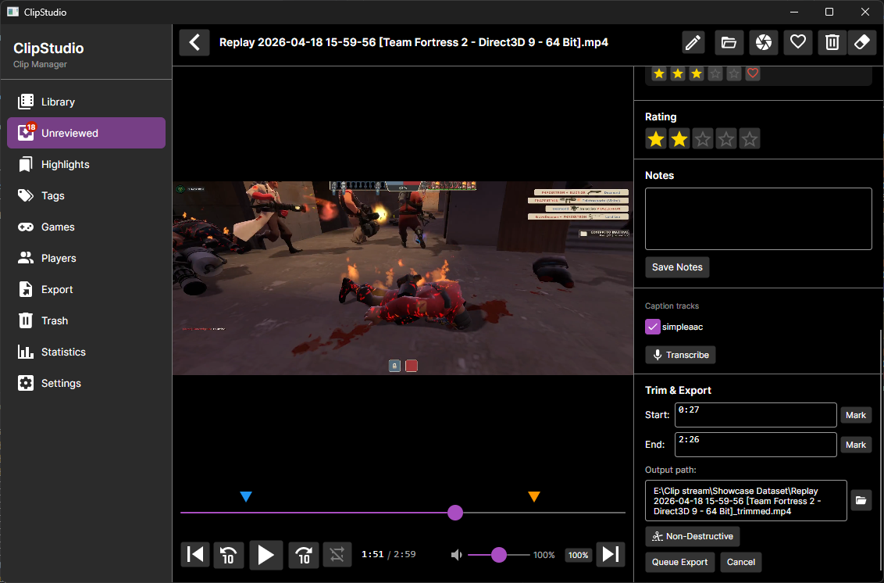 |

---

## Getting Started

### Requirements

#### Windows
| Dependency | Notes |
|---|---|
| [.NET 9 Runtime](https://dot.net/download) | Required to run the app |
| FFmpeg | Bundled automatically in the installer |
| LibVLC | Bundled automatically in the installer |

#### macOS
| Dependency | Notes |
|---|---|
| [.NET 9 Runtime](https://dot.net/download) | Required to run the app |
| [VLC media player](https://www.videolan.org/) | Must be installed — LibVLC is loaded from the system VLC installation |
| FFmpeg | Bundled automatically in the installer |

#### Linux
| Dependency | Notes |
|---|---|
| [.NET 9 Runtime](https://dot.net/download) | Required to run the app |
| `libvlc5` | Provides the LibVLC shared library used for video playback |
| FFmpeg | Bundled automatically in the installer |

Install Linux dependencies on Debian/Ubuntu:
```bash
sudo apt-get install libvlc5
```

Use the provided launcher script instead of running the binary directly — it automatically resolves the LibVLC library path so no developer packages are required:
```bash
./ClipStudio.sh
```

> **Why not bundled on Linux?** VideoLAN does not publish an official Linux NuGet bundle (unlike Windows). Linux `.so` files are compiled against a specific distro ABI and glibc version, so there is no single binary that works across all distributions. VLC also ships hundreds of codec plugin files that would add ~100 MB to every release. Using the system VLC keeps the package small and ensures security patches flow through your distro's package manager automatically.

### Download

Grab the latest installer from the [Releases](https://github.com/Phazertron/ClipStudio/releases) page.

Pick the file for your platform: `ClipStudio-win-Setup.exe`, `ClipStudio-osx-Setup.pkg`, or
`ClipStudio.AppImage`. After the first install, ClipStudio keeps itself up to date — see
[Updates](#updates).

### Build from Source

```bash
git clone https://github.com/Phazertron/ClipStudio.git
cd ClipStudio
dotnet restore
dotnet run --project src/ClipStudio.UI
```

Run tests:

```bash
dotnet test
```

### First Launch

A setup wizard runs on first launch and guides you through:

1. **Source folders** — select the folder(s) where your recording software saves replays (OBS, NVIDIA ShadowPlay, Xbox Game Bar, etc.)
2. **FFmpeg** — auto-detected or configured manually
3. **Transcription** — optional local Whisper model for caption generation
4. **Theme** — light or dark (dark by default)

Once the wizard completes, ClipStudio watches your source folders in the background. Any new video file that lands there is imported automatically and appears in the **Unreviewed** queue.

> **Tip — multiple profiles:** Launch with `--profile <name>` (e.g. `ClipStudio.exe --profile demo`) to run a completely isolated library under `%AppData%\ClipStudio_<name>\`. Useful for keeping a demo library separate from your real one.

---

### OBS Integration (Recommended)

The bundled OBS script renames each replay buffer save to embed the active game name, so ClipStudio can auto-suggest the game tag without any manual input.

**Produced filename format:**
```
Replay 2025-03-03 22-49-45 [Battlefield 1].mp4
```

**Installation:**

1. Open OBS Studio and go to **Tools → Scripts**.
2. Click **+** and select `obs-scripts/clipstudio_replay_tagger.py` from the repo (or your local copy).
3. Click **Close**. The script is now active for all replay buffer saves.

**Detection order** (the script tries each in sequence):

1. **OBS scene name** — name your scenes after the game you are recording (e.g. `Valorant`, `Deep Rock Galactic`). This is the most reliable method.
2. **Source name** — if you use a Game Capture or Window Capture source with *Capture Audio (BETA)* enabled, the source name is used as the game title. Name that source after the game.
3. **Foreground window title** — fallback that reads the active window. Works for most fullscreen games; may be noisy for windowed games.

Generic default names such as *Scene*, *Game Capture*, *Window Capture*, and *Game* are automatically ignored so the script always tries the next detection step.

> Only **Replay Buffer saves** are renamed. Regular recording stops are not affected.

---

### Manual Mode (No OBS Required)

ClipStudio works with any video files — OBS is not required.

1. Add any folder containing `.mp4`, `.mkv`, `.mov`, or `.avi` files as a source folder in **Settings → Source Folders**.
2. New files are detected automatically (or re-scan the folder manually from Settings).
3. Clips appear in the **Unreviewed** queue.
4. Open a clip to set the game tag manually: type a game name in the **Game** picker and select from the Steam-backed search results.

Files whose names already contain a `[Game Name]` bracket token (produced by any recording tool, not just OBS) are automatically parsed, and the game tag is pre-suggested in the Unreviewed queue.

---

## Usage Guide

### Reviewing Clips

New clips land in the **Unreviewed** queue. Open a clip to:

- Confirm or correct the suggested game title using the **Game** picker.
- Apply **general tags** from the Tags section in the side panel.
- Tag **players** (participants) from the Players section.
- Rename the clip inline using the pencil icon next to the title.
- Define **highlights** on the timeline — set in/out points, label them, add tags and a star rating.
- Export any highlight directly with the **Export** button on its row.
- Set a clip-level rating, write notes, or capture frame screenshots.
- View and search **captions** generated by local Whisper transcription.

Mark the clip as **Reviewed** when done to clear it from the queue.

### Tags and Highlights

- Tags are created in the **Tags** page and support a single-parent hierarchy and soft many-to-many relations.
- A clip **inherits** all tags from its highlights — searching for a tag matches both directly-tagged clips and clips that have a highlight with that tag.
- In the player, click a highlight row to jump to it and lock playback into a loop between its start and end times. Click the lock icon to unlock.
- The **Highlights** page shows all highlights across your entire library, filterable by rating, tag, and game.

### Trimming and Exporting

1. Open a clip and scroll to **Trim & Export** in the side panel.
2. Click **Begin Trim** — an output path is pre-filled automatically.
3. Seek to the start point and click **Mark Start**. Seek to the end point and click **Mark End**.
4. Click **Queue Export**. The job runs immediately in the background.

**Non-Destructive** (default): stream-copy only — instant, lossless, no re-encode.  
**Destructive**: FFmpeg re-encode — useful for precise frame-accurate cuts. Requires double confirmation. Optionally deletes the source file after export.

Export jobs and their status are visible on the **Export** page.

### Audio Tracks

When a clip has multiple audio tracks (e.g., game audio + microphone on separate OBS tracks):

- The **Audio Tracks** section appears in the side panel after playback starts.
- Rename tracks, toggle the **Include** checkbox, and adjust per-track volume (0–200 %).
- Changes trigger a real-time FFmpeg preview mix (debounced 300 ms) loaded by VLC as an audio slave.
- Click **Save Audio Settings** to persist the mix for future sessions.
- On export, original tracks are passed through unchanged (stream copy — no re-encode).

### Bulk Edit

Hover over a clip card to reveal a selection checkbox. Select multiple clips to open the bulk-edit panel:

- Add a tag, player, or game to all selected clips at once.
- Trash all selected clips with one confirmation.
- **Copy Format brush** — select exactly one clip and click the brush button. Click any other card to paste its tags, players, and game onto it. Press Escape to exit.

### Search and Filter

Use the **filter panel** (funnel icon in the Library toolbar) to combine:

- Free-text search against filenames, notes, and highlight labels
- Status (Unreviewed / Reviewed / Archived)
- Game tag, general tags, players
- Date range, duration range, star rating
- Has highlights / Is favourite

Use the **sort dropdown** to order by date, name, duration, or rating.  
Use the **view toggle** to switch between the tile grid and a compact table view.

### Related Clips

Any two clips can be linked from the **Related clips** panel in the clip editor. Choose how they
relate and the link is shown from both ends — with the wording flipped where it should be, so the
clip you marked as a *Sequel* shows its origin as a *Prequel*.

| Link type | Means |
|---|---|
| Same moment | The same moment from another angle, player or capture |
| Sequel | What happened next |
| Reaction | Someone reacting to the other clip |
| Variant | Another cut of the same footage |

Trashing a clip hides its links; restoring the clip brings them back. Deleting it permanently
removes them.

### Duplicates

ClipStudio recognises a recording it already holds, even imported under a different name. On import
you are asked whether to skip it, import it anyway, or **import and link** it to the copy you
already have.

Duplicates that are *already* in your library are found by **Settings → Attention required → Look
for duplicates**, which compares every hashed clip against every other. Matches are confirmed by
reading both files in full, so two different recordings that happen to share a quick hash are never
reported as duplicates.

**Inspect** a group to resolve it. The dialog plays the copy you have selected to keep, so you can
remind yourself what the clip actually is, and shows the two copies' tags, players, highlights,
rating and notes side by side. You choose which copy survives and what metadata it keeps; the
others go to the Trash, where they can be restored for 30 days.

Only one player is shown, deliberately: a confirmed duplicate is byte-identical, so playing both
copies would show the same pixels twice. What differs between them is the metadata, which is what
the comparison puts in front of you.

Once a scan has confirmed a group, it survives closing the app. The confirmed hashes are stored, so
the groups are rebuilt on the next launch from a single database query without re-reading a single
file — a scan you have already paid for is never lost.

### Importing Games from Your Launchers

**Games → Import from launchers** reads the titles installed on this computer and shows you what it
found. Nothing is created until you import: games you already have are unticked, and so is anything
that is not really a game — dedicated servers, soundtracks, demos and redistributables all install
as separate entries. Steam titles bring their AppId with them, so imported games get their cover art
without a search.

Steam is supported on Windows, macOS and Linux. Epic and GOG are not implemented yet.

### Background Activity

Scans, library repairs, duplicate searches, transcriptions and exports all report into the
**activity indicator** at the bottom of the sidebar. It shows what is running from any page, spins
the icon of the page the work belongs to, and keeps each finished task's full summary so a long
message is readable rather than truncated. Scans, repairs and duplicate searches can be stopped
from there.

### Keyboard Shortcuts

Shortcuts are active when the clip editor has focus, and are suppressed while a text field has it —
typing always wins over a shortcut. The full list is in **Settings → Keyboard shortcuts**.

| Key | Action |
|---|---|
| Space | Play / Pause |
| Left arrow | Skip backward |
| Right arrow | Skip forward |
| `,` (comma) | Previous frame |
| `.` (period) | Next frame |
| `C` | Show or hide subtitles |
| Escape | Close the clip |
| Alt + Left / Right | Previous / next clip |
| Alt + Up / Down | Previous / next highlight |
| `F` | Mark as favourite |
| `R` | Mark as reviewed |
| `0` – `5` | Set the rating |

---

## Updates

ClipStudio checks for a new release when it starts and every six hours after that, so a long
session still hears about one. **A check downloads nothing.**

When a newer version exists it appears in **Settings → Attention required**, and the Settings
navigation item is badged:

1. **ClipStudio x.y.z is available** — press **Download update** when you want it. Packages are
   around 250 MB, so nothing is transferred until you ask.
2. The download runs as a background task with live progress and a working **Cancel**, visible from
   any page. Cancelling is not refusing — the offer stays.
3. **Ready to install** — press **Restart and install**. Installing restarts the app, so it only
   ever happens when you say so.

Your library, settings and database are untouched by an update.

**Checking on demand.** *Settings → About* has a **Check for updates** button and a status line
showing where this build stands.

**Turning it off.** *Settings → Preferences → Check for updates automatically* stops ClipStudio
looking on its own. The About button still works with it off — the setting means "do not go
looking", not "refuse when asked".

---

## Architecture

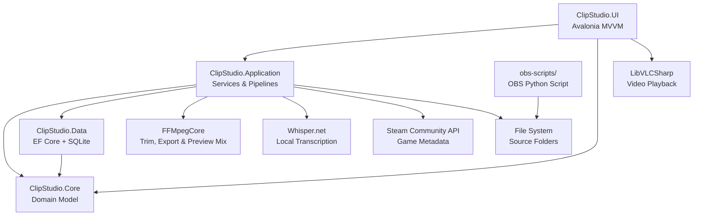

### Project Layout

```
ClipStudio/
├── docs/
│   └── screenshots/            # README screenshots
├── documentation/
│   ├── SPECIFICATION.md        # Full software specification
│   └── DECISION_LOG.md         # Architectural decision log
├── src/
│   ├── ClipStudio.Core/        # Domain entities, enums, repository interfaces
│   ├── ClipStudio.Data/        # EF Core DbContext, SQLite, repository implementations
│   ├── ClipStudio.Application/ # Application services, import pipeline, Steam integration
│   └── ClipStudio.UI/          # Avalonia MVVM UI (Views, ViewModels, Assets)
├── tests/
│   └── ClipStudio.Tests/       # xUnit + Moq + EF Core InMemory
├── obs-scripts/                # OBS Python replay-tagger script
└── ClipStudio.sln
```

---

## Tech Stack

| Concern | Technology |
|---|---|
| UI Framework | Avalonia UI 11 (Fluent theme, dark default) |
| Language | C# / .NET 9 |
| Database | SQLite via Entity Framework Core 9 |
| Video Playback | LibVLCSharp 3 + LibVLCSharp.Avalonia |
| Video Processing | FFMpegCore (thumbnails, preview strips, trim, export, audio mix) |
| Transcription | Whisper.net (local inference, CPU / Vulkan backend) |
| Dependency Injection | Microsoft.Extensions.DependencyInjection 9 |
| OBS Integration | Python script (OBS built-in scripting, v1.5.0) |
| Game Metadata | Steam Community Search API (credential-free) |
| Installed Games | Steam library files (`libraryfolders.vdf`, `appmanifest_*.acf`), read-only |
| Updates | Velopack 1.2.0 (Windows .exe, macOS .pkg, Linux AppImage), per-platform channels |
| Testing | xUnit + Moq + EF Core InMemory |

---

## Contributing

Issues and pull requests are welcome. Please open an issue first for significant changes so we can discuss the approach before implementation.

If ClipStudio saves you time, consider supporting development:

[](https://ko-fi.com/phazertron)

---

## License

ClipStudio is released under the [GNU General Public License v3.0](LICENSE).
