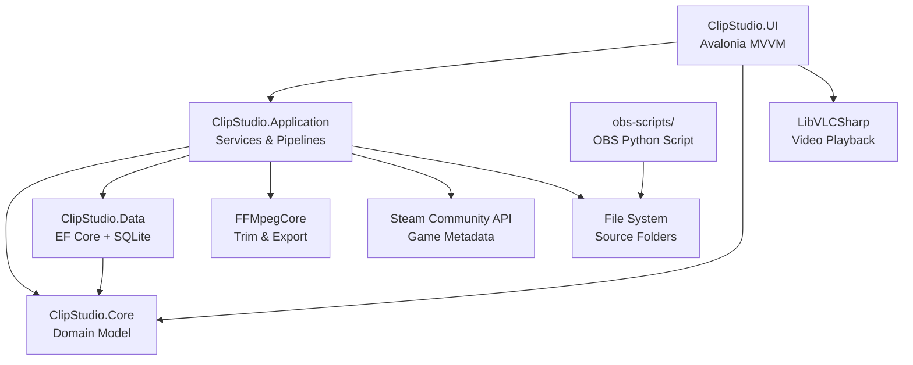

# ClipStudio

A cross-platform desktop application for managing, tagging, and curating gameplay video clips.
Designed for content creators and casual players who accumulate large replay libraries and need a structured,
searchable way to find and export the moments that matter.

---

## Repository Structure

```
ClipStudio/
├── src/
│   ├── ClipStudio.Core/            # Domain entities, enums, repository interfaces
│   │   ├── Entities/               # Clip, Tag, Highlight, Screenshot, ExportJob, ...
│   │   ├── Enums/                  # ClipStatus, TagType, TrimMode, ExportJobStatus
│   │   └── Interfaces/             # IClipRepository, ITagRepository, ...
│   ├── ClipStudio.Data/            # EF Core DbContext, SQLite, repository implementations
│   ├── ClipStudio.Application/     # Application services, import pipeline, Steam game search
│   └── ClipStudio.UI/              # Avalonia MVVM UI (Views, ViewModels, Assets)
├── tests/
│   └── ClipStudio.Tests/           # xUnit tests with Moq and in-memory EF Core
├── obs-scripts/                    # OBS Python script for game-name filename embedding
├── CLAUDE.md                       # Project guidelines for developers and AI agents
├── SPECIFICATION.md                # Full software specification
├── DECISION_LOG.md                 # Architectural and product decision log
└── ClipStudio.sln
```

---

## Architecture



---

## Tech Stack

| Concern | Technology |
|---|---|
| UI Framework | Avalonia UI 11 (Fluent theme, dark default) |
| Language | C# / .NET 9 |
| Database | SQLite via Entity Framework Core 9 |
| Video Playback | LibVLCSharp 3 + LibVLCSharp.Avalonia |
| Video Processing | FFMpegCore (thumbnail, preview strip, trim, export) |
| Dependency Injection | Microsoft.Extensions.DependencyInjection 9 |
| OBS Integration | Python script (OBS built-in scripting) |
| Game Metadata | Steam Community Search API (credential-free) |
| Testing | xUnit + Moq + EF Core InMemory |

---

## Setup Guide

### Prerequisites

- [.NET 9 SDK](https://dot.net/download)
- [VLC media player](https://www.videolan.org/) installed (provides native LibVLC libraries on macOS/Linux)
- FFmpeg — **bundled automatically** in the Velopack installer (no manual install required). For development builds, either install FFmpeg to your system PATH or set the path in Settings.
- (Optional) An [OBS Studio](https://obsproject.com/) installation if you want automatic game-name detection

### Build and Run

```bash
git clone https://github.com/your-org/ClipStudio.git
cd ClipStudio
dotnet restore
dotnet run --project src/ClipStudio.UI
```

### Run Tests

```bash
dotnet test
```

### OBS Script Installation (Optional)

1. Copy `obs-scripts/clipstudio_replay_tagger.py` to your local machine.
2. Open OBS Studio and go to `Tools > Scripts > +`.
3. Select the copied script and click OK.
4. OBS will now append the detected game name to replay buffer filenames automatically.

The script detects the active game in this order:
1. Current OBS scene name (name your scenes after the game for best results).
2. Window Capture source with **Capture Audio (BETA)** enabled — the last such source in the scene wins.
3. Active foreground window title (platform-specific fallback).

---

## How to Use

### First Launch

A setup wizard guides you through:
1. Selecting one or more source folders (where OBS saves your clips).
2. Detecting or locating FFmpeg (bundled automatically in the installer).
3. Choosing your preferred theme.

Re-trigger the wizard at any time by deleting `%AppData%\ClipStudio\settings.json`.

### Reviewing Clips

New clips land in the **Unreviewed** queue. Open a clip to:
- Confirm or correct the suggested game title using the Game Tag picker in the side panel.
- Apply general tags to the clip from the Tags section in the side panel.
- Tag players (participants) in the clip from the Players section in the side panel.
- Rename the clip inline using the pencil icon next to the title.
- Define highlights (tagged time ranges) on the timeline, then add tags to each highlight.
- Export any highlight directly using the Export button on the highlight row.
- Set a rating and add notes.
- Capture screenshots from specific frames.

### Keyboard Shortcuts

The clip player responds to the following keyboard shortcuts when the player view has focus (shortcuts are suppressed when a text field has keyboard focus):

| Key | Action |
|-----|--------|
| Space | Play / Pause |
| Left arrow | Skip backward (5 s) |
| Right arrow | Skip forward (5 s) |
| , (comma) | Step one frame backward |
| . (period) | Step one frame forward |

Click the video area to toggle play/pause.

### Tags and Highlights

- Create tags via the tag manager. Tags can have parent tags (hierarchy) and related tags (soft links).
- In the player, set an in-point and out-point to define a highlight, then apply one or more tags to it directly in the Highlights panel.
- Click a highlight row to jump to it and lock playback into a loop between its start and end times. Click the lock icon again to unlock.
- Overlapping highlights are fully supported and treated as independent.
- A clip inherits all tags from its highlights, making them appear in any relevant tag search.

### Renaming Clips

Click the pencil icon next to the clip title in the player to rename it inline.
- **Non-Destructive** (default): updates the display name in the database only — the physical file is not touched.
- **Destructive**: also renames the file on disk. Controlled by the Default Trim Mode setting in Settings.

### Trimming and Exporting

Use the **Trim & Export** section at the bottom of the clip detail side panel:
1. Click **Begin Trim** to enter trim mode. An output path is pre-filled automatically.
2. Seek to the desired start point and click **Mark Start**.
3. Seek to the desired end point and click **Mark End**.
4. Click **Queue Export** to add the job to the Export queue.

Select Non-Destructive (copy-only, no re-encode) or Destructive trim via the Default Trim Mode setting.

### Queue Navigation

When opening a clip from the Library or Unreviewed queue, **Previous** and **Next** buttons appear in the transport bar to move through the clip list without returning to the grid. A **Repeat** button toggles automatic loop of the current clip.

### Players

The **Players** page lets you manage participants who appear in your clips:
- Create a player with a display name, optional icon, and one or more aliases.
- Mark yourself with **IsMe** — new imported clips are automatically tagged with all IsMe players.
- Tag a player on any clip from the Players section in the clip detail side panel.
- Filter the library by player using the filter panel.

### Audio Tracks

When a clip has multiple audio tracks (e.g., game audio and microphone on separate tracks):
- The **Audio Tracks** section appears in the clip detail side panel after playback starts.
- Rename tracks, toggle the **Include** checkbox to include or exclude each track from the preview mix, and adjust volume (0–200 %).
- Changes trigger a real-time FFmpeg mix (debounced 300 ms) that VLC loads as an audio slave, so you hear the adjusted blend immediately.
- Mixed preview files are cached in `%AppData%\ClipStudio\audio_cache\` to avoid redundant FFmpeg runs (toggle in Settings under **Cache Audio Previews**).
- Click **Save Audio Settings** to persist the settings to the database for future sessions.
- On export, all original audio tracks are passed through unchanged (stream copy — no re-encode, no mixing).
- Use the **master volume** slider in the transport bar to adjust VLC playback volume.

### Multi-Select and Bulk Edit

Hover over a clip card to reveal a selection checkbox. Check multiple clips to open the bulk-edit panel on the right side of the library:
- Add a tag, player, or game to all selected clips at once.
- Trash all selected clips with a single confirmation.
- **Copy Format brush**: when exactly one clip is selected, a brush button appears. Click it to enter copy-format mode, then click any other card's checkbox to paste the source clip's tags, players, and game onto it. Press Escape or click the brush button again to exit.

### Search and Filter

Use the filter panel (funnel icon in the Library toolbar) to combine:
- Free-text search against filenames, notes, and highlight labels.
- Status (Unreviewed / Reviewed / Archived).
- Game tag.
- Date range (from / to).

Use the **sort dropdown** to order results by date, name, duration, or rating.
Use the **view toggle** (list icon) to switch between the tile grid and a compact details table showing name, game, date, duration, and rating.

### Exporting

Jobs queued from the trim panel or the highlight Export button appear in the **Export** page. Select Non-Destructive (copy-only, no re-encode) or Destructive (FFmpeg re-encode). Destructive export requires double confirmation.
